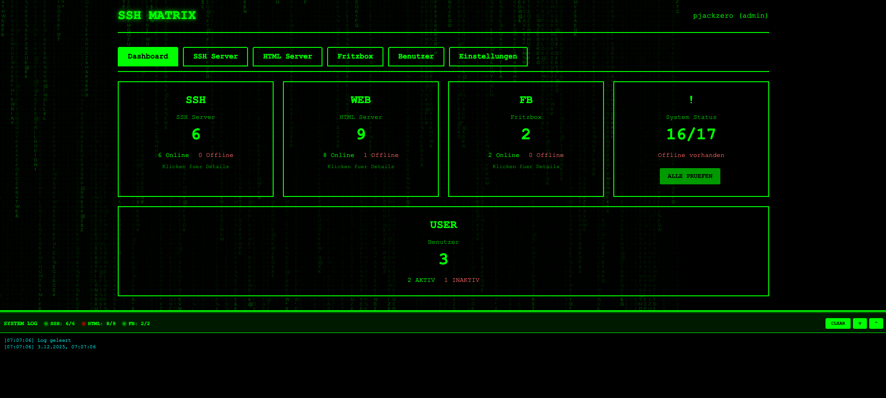

# SSH Matrix 🖥️

[](https://www.docker.com/)
[](https://nodejs.org/)
[](LICENSE)

A web-based SSH server management and monitoring tool with a Matrix-inspired UI. Monitor your SSH servers, HTML services, and Fritzbox devices from a single dashboard.



## ✨ Features

- 🖥️ **SSH Server Management** - Add, edit, and connect to SSH servers via web terminal
- 🌐 **HTML/Web Server Monitoring** - Monitor HTTP/HTTPS services
- 📡 **Fritzbox Integration** - Monitor your Fritzbox devices
- 👥 **User Management** - Multi-user support with roles (Admin/User)
- 🔐 **2FA Authentication** - Optional TOTP two-factor authentication
- 📊 **Real-time Dashboard** - Live status updates for all monitored services
- 🎨 **Themes** - Matrix, Dark, and Light mode
- 🌍 **Multilingual** - German and English support
- 📝 **Audit Log** - Track all user actions
- 🔄 **Auto-Check** - Automatic status checks every 5 minutes

## 🚀 Quick Start

### Using Docker Compose (Recommended)

```bash
# Clone the repository
git clone https://github.com/pjackzero1/ssh-matrix.git
cd ssh-matrix

# Start with Docker Compose
docker compose up -d

# Access the application
open http://localhost:3000
```

### Using Dockge

1. Create a new stack in Dockge
2. Copy the content from `docker-compose.yaml`
3. Deploy the stack

### Default Login Credentials

| Username | Password | Role |
|----------|----------|------|
| admin | admin123 | Admin |

⚠️ **Change the default password immediately after first login!**

## 📋 Configuration

### Environment Variables

| Variable | Default | Description |
|----------|---------|-------------|
| `PORT` | `3000` | Server port |
| `DB_DIR` | `/data` | Database directory |
| `JWT_SECRET` | `change-this...` | JWT signing secret (**change in production!**) |
| `NODE_ENV` | `production` | Node environment |

### Docker Compose Configuration

```yaml
version: "3.8"

services:
  ssh-matrix:
    build: .
    container_name: ssh-matrix
    ports:
      - "3000:3000"
    volumes:
      - ssh-matrix-data:/data
    environment:
      - NODE_ENV=production
      - PORT=3000
      - DB_DIR=/data
      - JWT_SECRET=your-secure-secret-here
    restart: unless-stopped

volumes:
  ssh-matrix-data:
```

## 🔧 Manual Installation

```bash
# Clone repository
git clone https://github.com/pjackzero1/ssh-matrix.git
cd ssh-matrix

# Install dependencies
npm install

# Create data directory
mkdir -p data

# Set environment variables
export DB_DIR=./data
export JWT_SECRET=your-secret-key

# Start the server
npm start
```

## 📁 Project Structure

```
ssh-matrix/
├── server.js           # Main server application
├── public/
│   └── index.html      # Frontend SPA
├── docker-compose.yaml # Docker Compose configuration
├── Dockerfile          # Docker build instructions
├── package.json        # Node.js dependencies
├── .env.example        # Example environment configuration
└── README.md           # This file
```

## 🔐 Security Notes

1. **Change the default admin password** after first login
2. **Set a strong JWT_SECRET** in production (use `openssl rand -base64 32`)
3. **Enable 2FA** for admin accounts
4. Use **HTTPS** in production (configure a reverse proxy like Nginx or Traefik)
5. **Firewall** - Only expose port 3000 to trusted networks

## 🔄 Updating

```bash
# Pull latest changes
git pull

# Rebuild and restart
docker compose down
docker compose build --no-cache
docker compose up -d
```

## 🐛 Troubleshooting

### Container won't start
```bash
# Check logs
docker compose logs -f ssh-matrix

# Reset database (WARNING: deletes all data)
docker compose down -v
docker compose up -d
```

### Cannot connect to SSH server
- Verify the SSH server is reachable from the Docker container
- Check firewall rules
- Ensure SSH port is correct (default: 22)

### Permission denied errors
```bash
# Fix data directory permissions
docker compose exec ssh-matrix chown -R nodejs:nodejs /data
```

## 📝 API Endpoints

| Endpoint | Method | Description |
|----------|--------|-------------|
| `/api/auth/login` | POST | User login |
| `/api/auth/register` | POST | User registration |
| `/api/ssh-servers` | GET/POST | SSH servers CRUD |
| `/api/html-servers` | GET/POST | HTML servers CRUD |
| `/api/fritzboxes` | GET/POST | Fritzbox CRUD |
| `/api/users` | GET | List users (admin) |
| `/api/2fa/setup` | POST | Setup 2FA |
| `/ws/ssh/:id` | WebSocket | SSH terminal connection |

## 🤝 Contributing

Contributions are welcome! Please feel free to submit a Pull Request.

## 📄 License

This project is licensed under the MIT License - see the [LICENSE](LICENSE) file for details.

## 🙏 Acknowledgments

- [xterm.js](https://xtermjs.org/) - Terminal emulator
- [ssh2](https://github.com/mscdex/ssh2) - SSH client for Node.js
- [Express](https://expressjs.com/) - Web framework
- Matrix movie for the UI inspiration

---

Made with ❤️ by [pjackzero1](https://github.com/pjackzero1)
